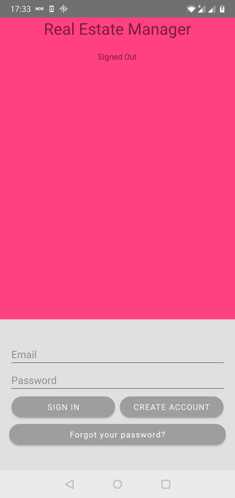
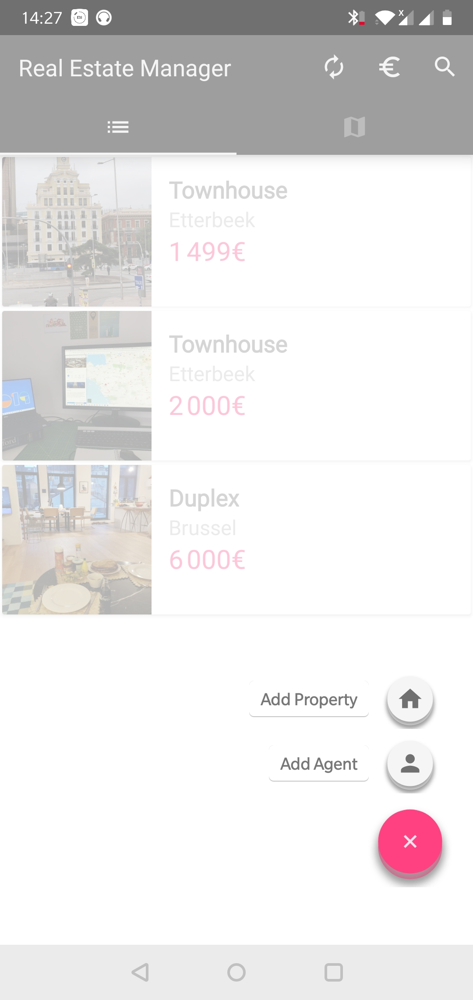
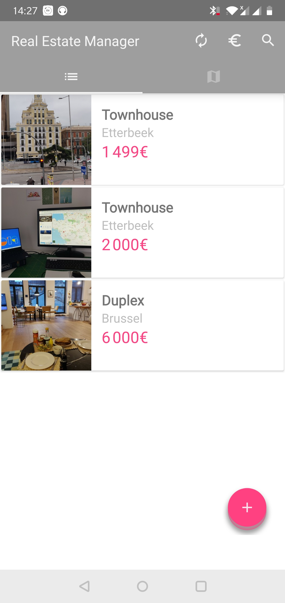
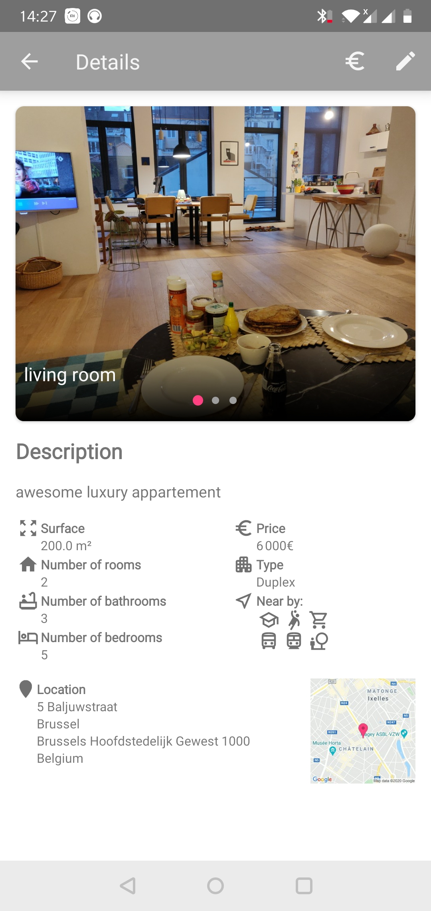
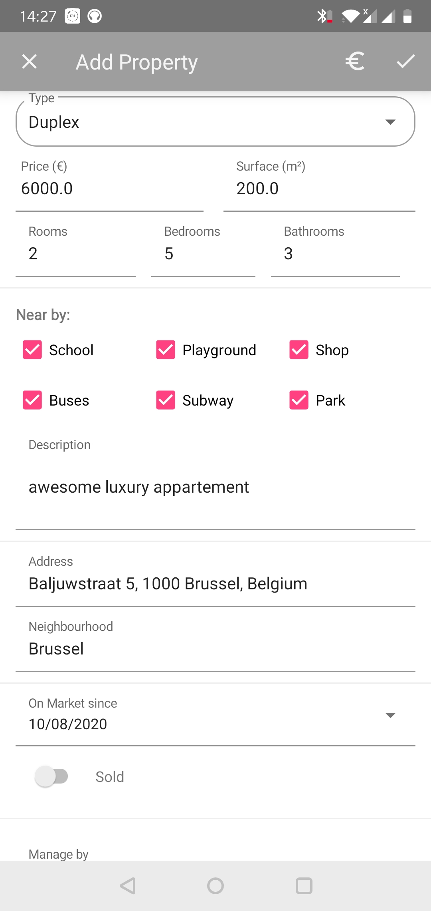
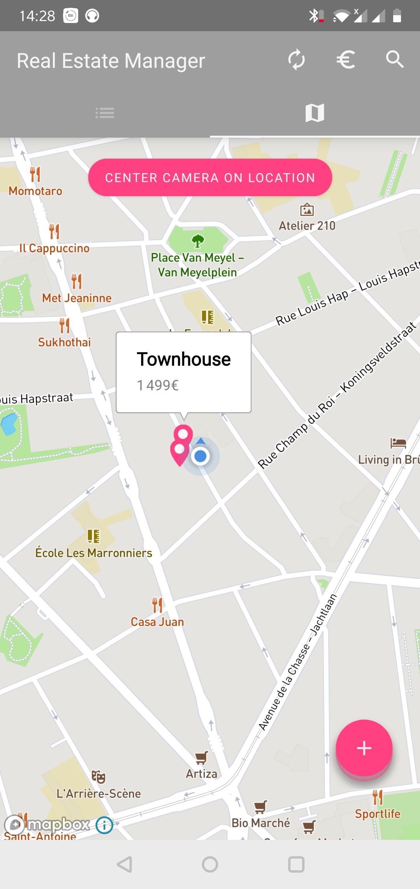
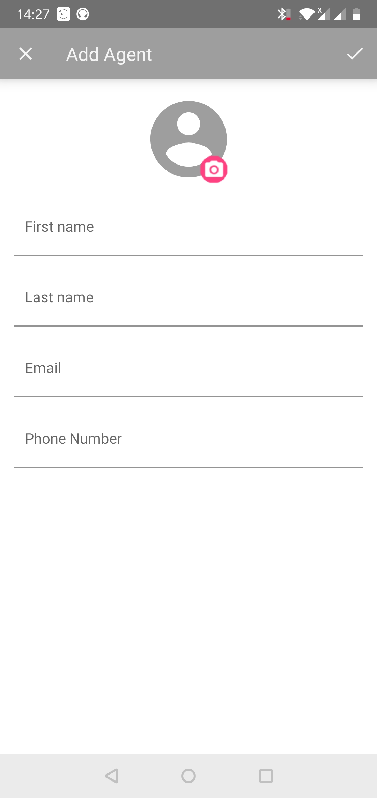

# RealEstateManager
OpenClassrooms Project 9 : Android mobile application allowing agents to access different real estate listings from their mobile devices.

 &ensp;
&ensp;

 &ensp; &ensp;
&ensp;&ensp;

### Skills
-   Create and configure a SQLite database
    
-   Create a personalized view
    
-   Manage and show notification messages
    
-   Personalize a toolbar
    
-   Complete a suite of unit and integration tests to reflect changes made
    
-   Correct application errors reported by a client
    
-   Share content with third party applications
    
-   Make improvements to existing functionalities as requested by a client
    
-   Store and retrieve information within a database using SQL
## Libraries Used

-   [Android Support Library](https://developer.android.com/topic/libraries/support-library/)
-   [Room Persistence Library](https://developer.android.com/topic/libraries/architecture/room)
-   [Mapbox Android SDK](https://docs.mapbox.com/android/maps/overview/)
-   [Smarteist Image Slider](https://github.com/smarteist/Android-Image-Slider)
-   [Easy Permissions](https://github.com/googlesamples/easypermissions)
-   [Espresso](https://developer.android.com/training/testing/espresso)
- -   [Glide](https://github.com/bumptech/glide/)
-   [Gson](https://github.com/google/gson/)
-   [ButterKnife](https://jakewharton.github.io/butterknife/)
-   [Retrofit](https://square.github.io/retrofit/)
-   [RxJava](https://github.com/ReactiveX/RxJava)
-   [Cloud Firestore](https://firebase.google.com/docs/firestore)
-   [Firebase Authentification](https://firebase.google.com/docs/auth)
-   [Cloud Storage](https://firebase.google.com/docs/storage)

&ensp;
&ensp;

## Developed By

[**Mutwakil Mo**](https://www.linkedin.com/in/mutwakil-mo/)

## License

    Copyright 2020 Mutwakil Mo

    Licensed under the Apache License, Version 2.0 (the "License");
    you may not use this file except in compliance with the License.
    You may obtain a copy of the License at

         http://www.apache.org/licenses/LICENSE-2.0

    Unless required by applicable law or agreed to in writing, software
    distributed under the License is distributed on an "AS IS" BASIS,
    WITHOUT WARRANTIES OR CONDITIONS OF ANY KIND, either express or implied.
    See the License for the specific language governing permissions and
    limitations under the License.
